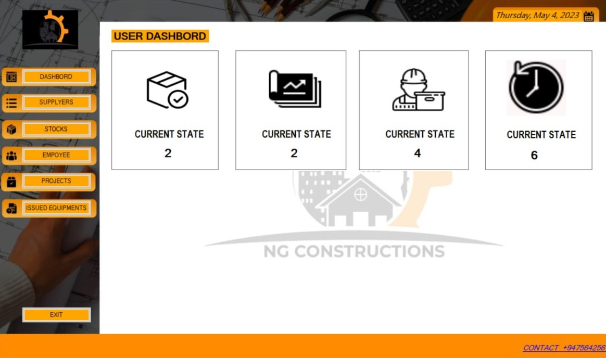

#  

 

# INTRODUCTION 

NG Construction is established by the Sri Lankan entrepreneurs in 2021. NG construction organization specializes in designing, planning and managing building projects. They involve for medium scale projects development as well.  

When we consider NG Construction, it consists of more than 50+ employees including permanent and contract basis employees. Such as Architects, project managers, constructors, technical expertise, workers etc. Throughout the organization the final objective is to ensure the project success by having safety, efficiently ang high quality. Finally, they expect customer satisfaction by providing better quality projects to the world.

Further as developing organization, they decided to convert their manual process into the systemized for optimize their workload and come up with the best out of best from the organization. So as a group, we identified the organization current process and environment, then we created the this system by including the new features which make easy their day-to-day work task instead of proceeding it manually. 

1- Required software:
* Visuel Studio
* .Net Framework 4.8 
* XAMPP or Wamp (optional)
* Windows Support OS

2-Interfacse

>Lording

*ADMIN SECTION

>Admin Login

>Dashbord

>Suppyers

>Stock

>Employee

>Projects

>History Records

*USER SECTION

>User Login

>Dashbord

>Supplyers

>Stock

>Employee

>Projects

>Issued Items

